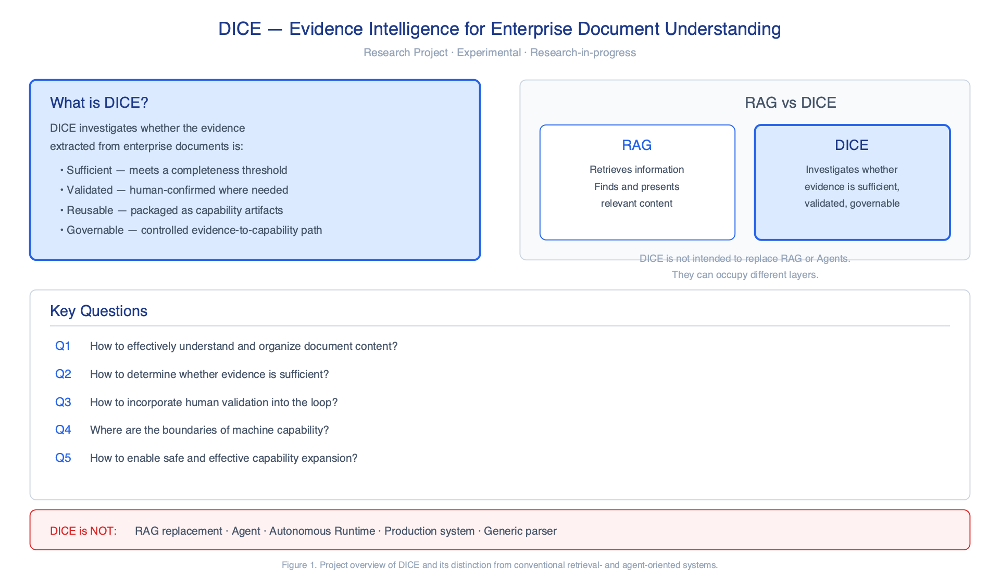
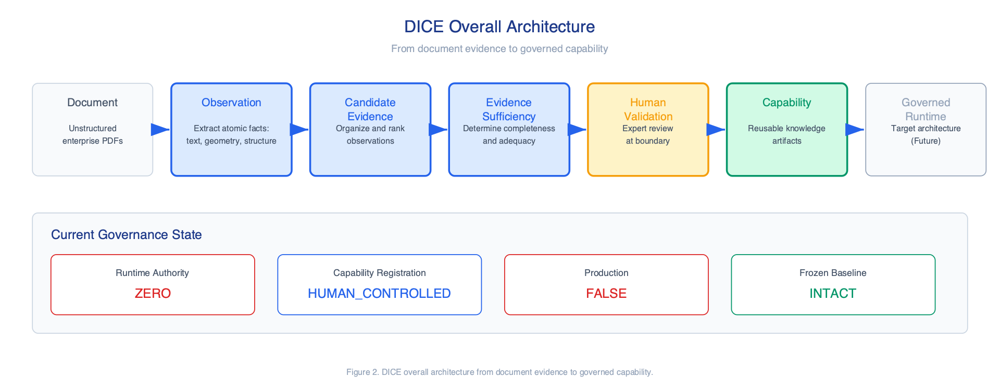
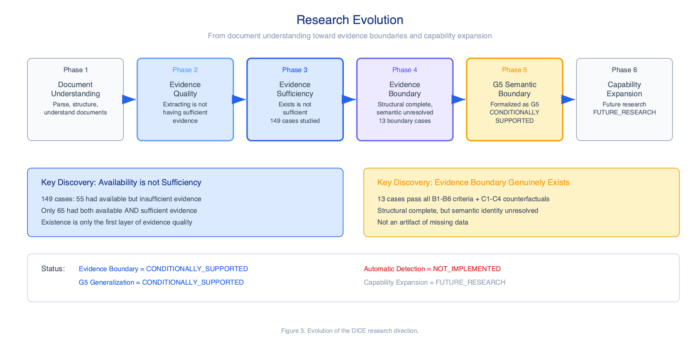
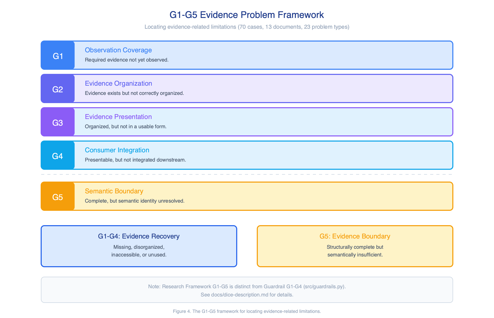
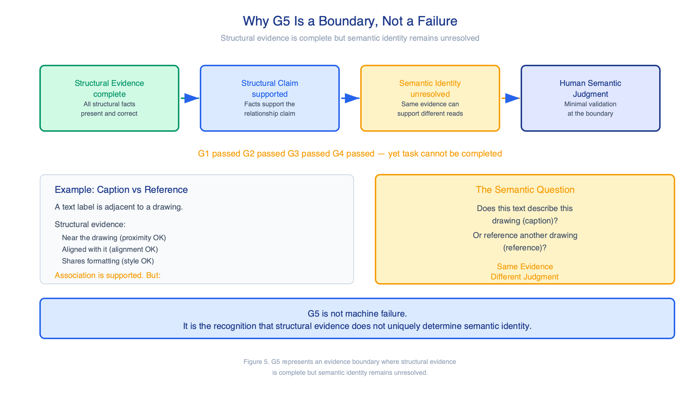
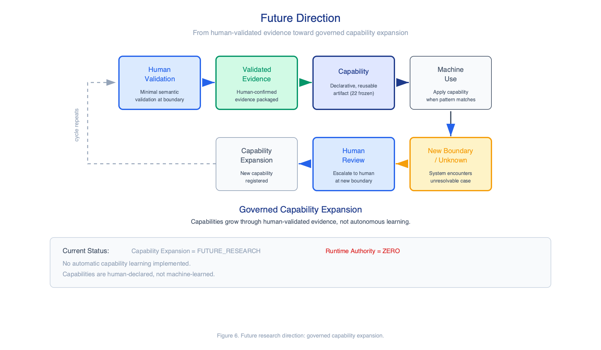
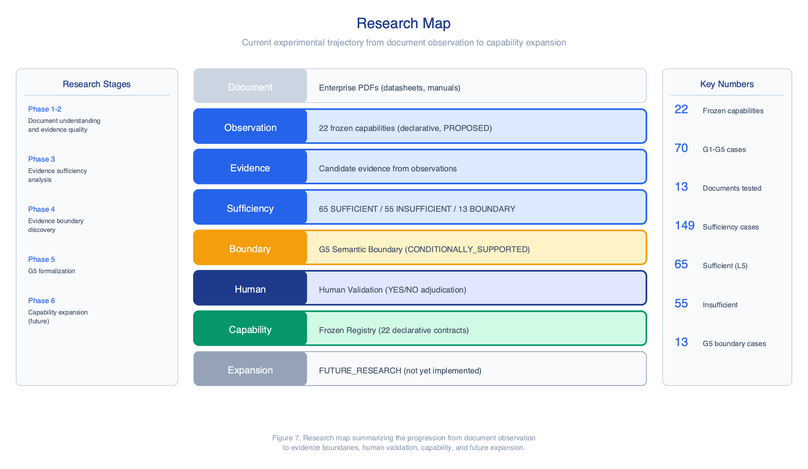

# DICE — Evidence Intelligence for Enterprise Document Understanding

> **Research Project · Experimental · Research-in-progress**
>
> DICE is not production-ready, not fully autonomous, and not a general-purpose system.

DICE (Document Intelligence Capability Engineering) is a research project that investigates **Evidence Intelligence** — whether the evidence extracted from enterprise documents is sufficient, validated, reusable, and governable.

---

## What is DICE?

DICE addresses a question that conventional document AI systems do not ask:

> Given information extracted from enterprise documents, **is the evidence sufficient** to support a decision or a capability claim — and if not, where exactly does it fall short?

Most systems focus on *retrieving more information*. DICE focuses on *investigating evidence quality*: whether the available evidence meets a completeness threshold, whether it requires human semantic validation, and whether validated evidence can be packaged as a reusable, governed capability.

### DICE is not:

- **Not a RAG replacement.** RAG retrieves; DICE investigates evidence quality and boundary. They can occupy different layers.
- **Not an Agent.** Agents act; DICE investigates whether evidence is sufficient to act.
- **Not an Autonomous Runtime.** Runtime Authority = ZERO. The system recommends; humans decide.
- **Not a Production system.** Production = FALSE.
- **Not a Generic document parser.** Parsing is a means; the end is evidence intelligence.



*Figure 1. Project overview of DICE and its distinction from conventional retrieval- and agent-oriented systems.*

---

## DICE Overall Architecture

DICE is organized around a seven-stage processing chain:

```
Document → Observation → Candidate Evidence → Evidence Sufficiency → Human Validation → Capability → Governed Runtime
```

| Stage | Role |
|---|---|
| **Document** | Enterprise documents — datasheets, technical specifications, instruction manuals — typically complex, multi-column, mixed-format PDFs. |
| **Observation** | The system records atomic, verifiable facts: text content, geometric positions, structural relationships, visual-geometric properties. |
| **Candidate Evidence** | Observations are organized into candidate evidence that may be relevant to a specific extraction task. Sufficiency has not yet been assessed. |
| **Evidence Sufficiency** | The system investigates whether candidate evidence is complete enough. This is where DICE's core research contribution — the **Evidence Boundary** — lies. |
| **Human Validation** | When evidence reaches a boundary where structural facts alone cannot determine the answer, a human provides minimal semantic validation. |
| **Capability** | Validated evidence is packaged as a **Capability Artifact** — a declarative, reusable unit registered in a frozen registry of 22 extraction contracts. |
| **Governed Runtime** | The target architecture boundary — not a current production system. Capabilities would execute under governance: zero autonomous authority, human-controlled registration. |

### Current Governance State

| Property | Value |
|---|---|
| Runtime Authority | **ZERO** — the system recommends; humans decide |
| Capability Registration | **HUMAN_CONTROLLED** — all 22 capabilities are declarative, PROPOSED status |
| Production | **FALSE** — no production runtime is active |
| Frozen Baseline | **INTACT** — 22 capability definitions are frozen; none promoted without human approval |



*Figure 2. DICE overall architecture from document evidence to governed capability.*

---

## Research Evolution

DICE did not begin as a fully defined system. Its current Evidence Intelligence direction emerged through successive research phases, each driven by a discovery that reframed the previous question.

| Phase | Discovery |
|---|---|
| **Phase 1: Document Understanding** | How do we effectively parse, structure, and understand complex enterprise documents? → Led to perception engines extracting atomic observations. |
| **Phase 2: Evidence Quality** | "Extracting information" ≠ "having sufficient evidence." Observations may exist but be incomplete, disorganized, or unconsumed. |
| **Phase 3: Evidence Sufficiency** | "Evidence exists" ≠ "evidence is sufficient." In 149 cases: 55 had available but insufficient evidence; only 65 had both available AND sufficient. |
| **Phase 4: Evidence Boundary** | Even when structural evidence is complete, some tasks require semantic judgment that structure alone cannot provide. 13 cases passed all boundary criteria. |
| **Phase 5: G5 Semantic Boundary** | The boundary was formalized as G5 — structural evidence complete, semantic identity unresolved. **CONDITIONALLY_SUPPORTED.** |
| **Phase 6: Capability Expansion** | How can human-validated evidence safely become reusable capability? **FUTURE_RESEARCH** — not yet implemented. |

> DICE's research value comes not only from final conclusions, but from the continuous process of locating failure hypotheses, evidence gaps, and boundaries.



*Figure 3. Evolution of the DICE research direction from document understanding toward evidence boundaries and capability expansion.*

---

## G1–G5 Evidence Problem Framework

Through analyzing **70 failure cases** across **13 documents** and **23 problem types**, DICE research identified a five-layer framework for locating evidence-related limitations.

| Layer | Name | Description |
|---|---|---|
| **G1** | Observation Coverage | Required evidence was not observed. The perception layer did not capture it. |
| **G2** | Evidence Organization | Evidence exists but is not correctly organized or associated. |
| **G3** | Evidence Presentation | Evidence exists and is organized, but is not in a usable form for consumers. |
| **G4** | Consumer Integration | Evidence is presentable, but not correctly integrated into the downstream process. |
| **G5** | Semantic Boundary | Evidence is complete, organized, presented, and consumed — but semantic identity remains unresolved. |

**G1–G4** are evidence recovery/organization problems: the evidence is missing, disorganized, inaccessible, or unused. In principle, these can be addressed by improving the pipeline.

**G5** is an evidence boundary problem: the evidence is structurally complete but semantically insufficient. Adding more structural evidence of the same type does not resolve it.

> **Terminology note:** The Research Framework G1–G5 (classifying *where* evidence fails) is distinct from the Guardrail G1–G4 in `src/guardrails.py` (asserting *whether* a specific output is valid). Both use the "G" prefix but address different concerns.



*Figure 4. The G1–G5 framework for locating evidence-related limitations (70 cases, 13 documents, 23 problem types).*

---

## Why G5 Is a Boundary, Not a Failure

This is one of DICE's most important research insights.

### The Structure

```
Structural Evidence complete
  → Structural Claim supported
    → Semantic Identity unresolved
      → Human Semantic Judgment
```

In G5 cases, every structural fact is present and correct: G1 passed (observed), G2 passed (organized), G3 passed (presentable), G4 passed (consumed). And yet, the task cannot be completed by structural evidence alone.

### Why?

Because in some cases, **the same structural evidence can support different semantic interpretations.**

Consider a text label adjacent to a drawing. Structurally: the text is near the drawing, aligned with it, and shares formatting. All structural evidence points to an association. But the semantic question — *"Does this text describe this drawing (caption), or reference another drawing (reference)?"* — cannot be answered by spatial evidence alone. Both interpretations are consistent with the same structural facts.

> **Same Evidence → Different Human Judgment**

### What This Means

G5 is not "machine failure." It is the recognition that **structural evidence does not uniquely determine semantic identity.** Adding more geometry, alignment, or formatting does not resolve it. The boundary is not a data problem — it is a semantic identity problem.

DICE does not claim that future models will automatically resolve G5. That is a hypothesis this research has not proven.



*Figure 5. G5 represents an evidence boundary where structural evidence is complete but semantic identity remains unresolved.*

---

## Current Research Status

| Area | Current Status |
|---|---|
| Evidence Boundary | **CONDITIONALLY_SUPPORTED** |
| G5 Generalization | **CONDITIONALLY_SUPPORTED** |
| Automatic Boundary Detection | **NOT_IMPLEMENTED** |
| Capability Expansion | **FUTURE_RESEARCH** |
| Production Runtime | **FALSE** |
| Runtime Authority | **ZERO** |
| Capability Registration | **HUMAN_CONTROLLED** |
| Frozen Baseline | **INTACT** |

> No research conclusion has been modified for presentation. All statuses reflect the frozen research baseline as of the last experiment freeze.

---

## Future Direction

DICE's next research direction is not "make the model smarter." It is:

> How can human-validated evidence safely become reusable capability, and how can the system expand when new unknown boundaries appear?

### The Envisioned Loop

```
Human Validation → Validated Evidence → Capability → Machine Use
  → New Boundary / Unknown → Human Review → Capability Expansion
```

The principle: humans provide minimal semantic validation at the boundary; the machine absorbs validated evidence as a governed capability; when a new boundary appears, the system escalates to human review and the cycle repeats. This forms **Governed Capability Expansion** — capabilities grow through human-validated evidence, not autonomous learning.

**Capability Expansion is FUTURE_RESEARCH.** No automatic capability learning has been implemented. Capabilities are human-declared, not machine-learned.



*Figure 6. Future research direction: from human-validated evidence toward governed capability expansion.*

---

## Research Map

The research map summarizes the current experimental trajectory:

```
Document → Observation (22 frozen capabilities) → Evidence
  → Sufficiency (65 SUFFICIENT / 55 INSUFFICIENT / 13 BOUNDARY)
    → Boundary (G5 Semantic Boundary) → Human (Validation)
      → Capability (Frozen Registry) → Expansion (FUTURE_RESEARCH)
```

### Key Numbers

| Metric | Value |
|---|---|
| Frozen capabilities | 22 |
| G1–G5 validation cases | 70 (13 documents, 23 problem types) |
| Evidence sufficiency cases | 149 total |
| Sufficient (L5) | 65 |
| Insufficient | 55 |
| G5 boundary cases (pass B1–B6 + C1–C4) | 13 |



*Figure 7. Research map summarizing the progression from document observation to evidence boundaries, human validation, capability, and future expansion.*

---

## Research & Discussion

DICE is an ongoing research project. Researchers and engineers working on document intelligence, evidence-grounded systems, human-in-the-loop learning, or capability engineering are welcome to:

- **Discuss** the research design and methodology
- **Reproduce** experiments using the synthetic and public-domain data in this repository
- **Challenge** current hypotheses — alternative interpretations of the Evidence Boundary are particularly valuable
- **Propose** better experimental designs or alternative approaches to G5 detection
- **Contribute** to evidence boundary research, capability engineering, or reproducibility improvements

If you have alternative interpretations, experimental critiques, or ideas for better experimental design, you are encouraged to open an issue or start a discussion. DICE does not claim its conclusions are final — the research is explicitly **CONDITIONALLY_SUPPORTED**, and constructive disagreement is welcome.

See [CONTRIBUTING.md](CONTRIBUTING.md) for the contribution process and [docs/data-policy.md](docs/data-policy.md) for data submission rules (no enterprise or proprietary data).

---

## Further Reading

| Document | Description |
|---|---|
| [Project Description](docs/dice-description.md) | Complete, systematic DICE project description with all 7 figures |
| [Research Status](docs/research-status.md) | Detailed status of each research question |
| [Architecture](docs/architecture.md) | Component overview: perception, evidence store, runtime, guardrails |
| [Reproducibility](docs/reproducibility.md) | How to reproduce experiments |
| [Data Policy](docs/data-policy.md) | What data is and is not included |
| `research/` directory | Detailed experiment reports, case tables, and analysis |
| `capabilities/` directory | 22 frozen capability declarations (declarative JSON) |
| `src/` directory | Core code: DICE package, perception, chunker, guardrails |

---

## License

MIT — see [LICENSE](LICENSE).

## Citation

See [CITATION.cff](CITATION.cff).

---

*DICE is an ongoing research project. This document describes the current research state as of the last experiment freeze. No research conclusions have been modified for presentation.*
