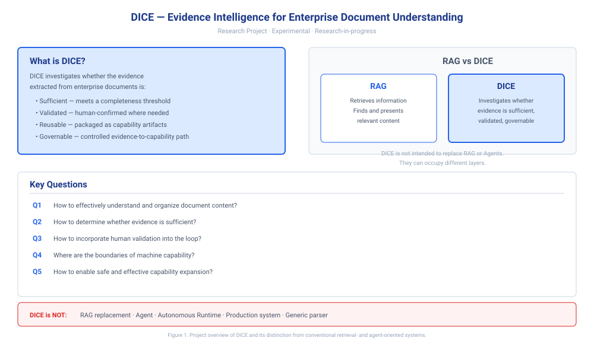
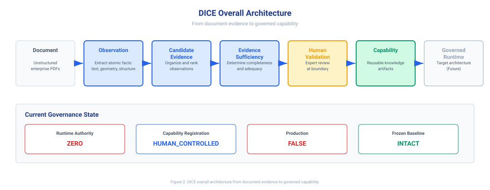
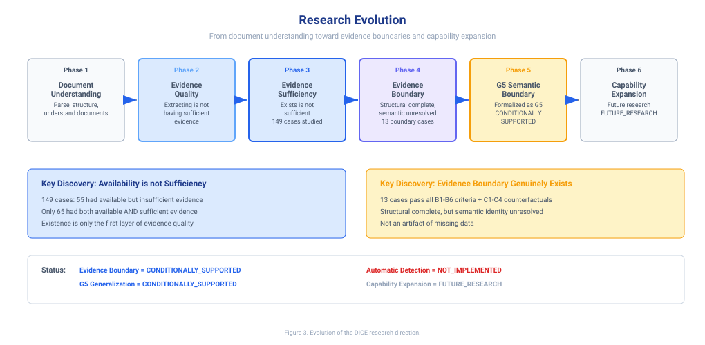
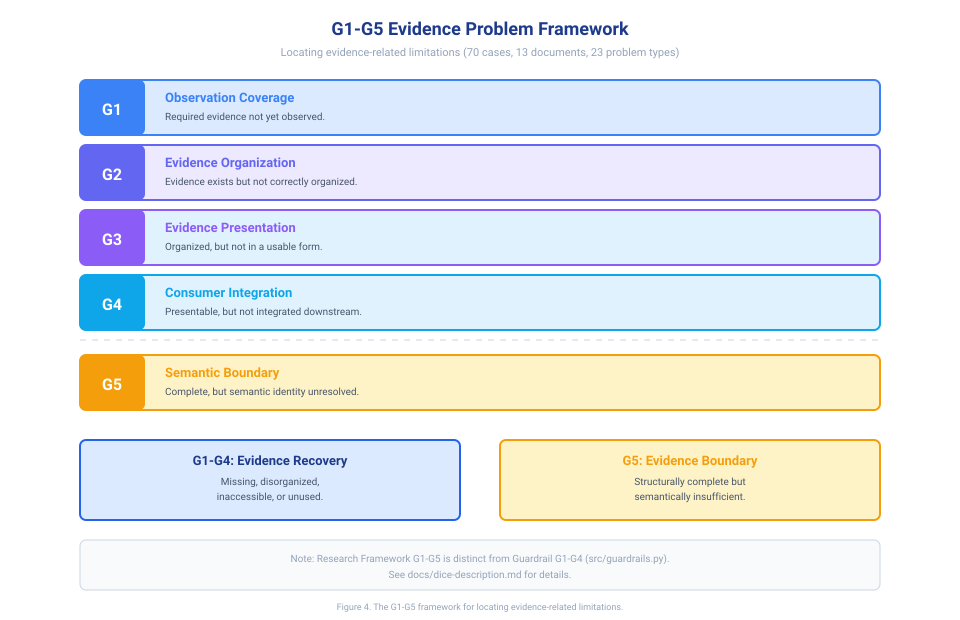
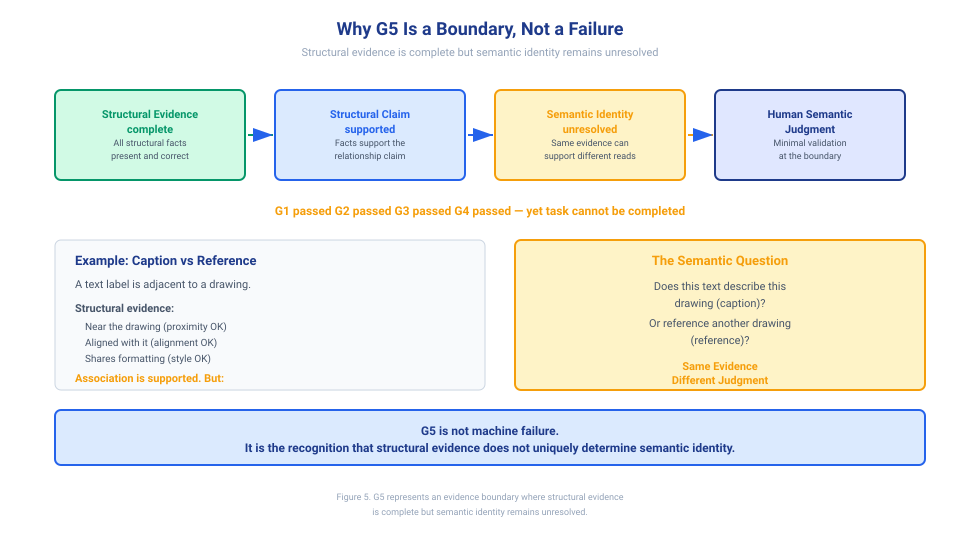
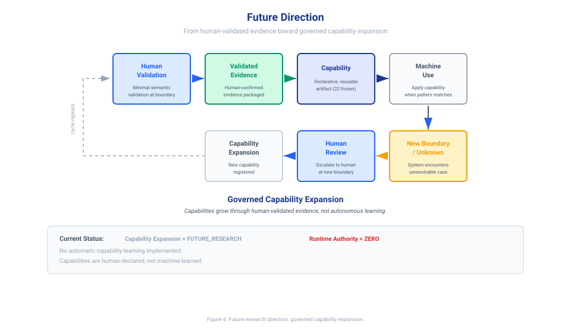
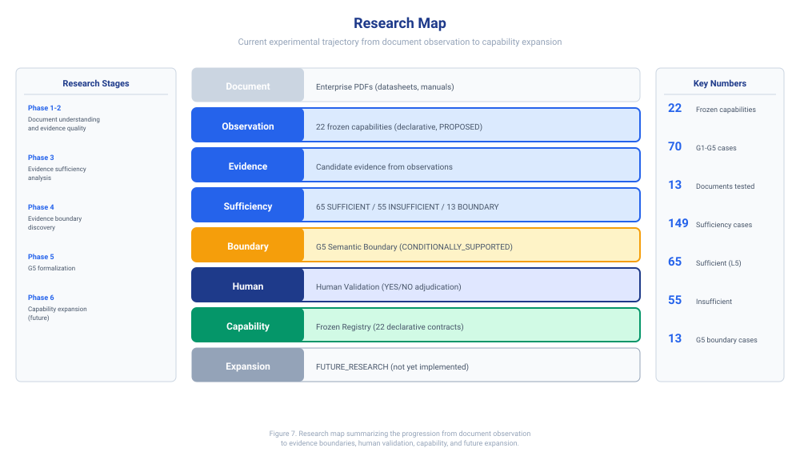

# DICE — Evidence Intelligence for Enterprise Document Understanding

> **Research Project. Experimental. Research-in-progress.**
>
> DICE is not production-ready, not fully autonomous, and not a general-purpose system.

---

## Current Research Status

| Question | Status |
|---|---|
| Evidence Boundary | CONDITIONALLY_SUPPORTED |
| G5 Generalization | CONDITIONALLY_SUPPORTED |
| Automatic Boundary Detection | NOT_IMPLEMENTED |
| Capability Expansion | FUTURE_RESEARCH |
| Production Runtime | FALSE |
| Runtime Authority | ZERO |
| Capability Registration | HUMAN_CONTROLLED |
| Frozen Baseline | INTACT |

---

## 1. What is DICE?

DICE (Document Intelligence Capability Engineering) is a research project that investigates **Evidence Intelligence** for enterprise document understanding.

The problem DICE addresses is not:

> "How do we retrieve more information?"

It is:

> "Given information extracted from enterprise documents, how do we determine whether the available evidence is sufficient, how should it be validated by humans, and which validated evidence can become reusable capability?"

### RAG retrieves information. DICE investigates evidence.

RAG (Retrieval-Augmented Generation) systems retrieve relevant information from a corpus and pass it to a language model. They are effective at finding and presenting information.

DICE asks a different question: once information has been extracted from a document, **is the evidence sufficient to support a decision or a capability claim?** DICE investigates whether the evidence is:

- **Sufficient** — does the available evidence meet a completeness threshold for the task?
- **Validated** — has a human confirmed the evidence where semantic judgment is required?
- **Reusable** — can the validated evidence be packaged as a capability artifact for future use?
- **Governable** — is there a controlled path from evidence to capability, with clear authority boundaries?

DICE is not intended to replace RAG or Agents. RAG, Agent, and DICE can occupy different layers in a system: RAG retrieves, Agents act, DICE investigates evidence quality and boundary.



*Figure 1. Project overview of DICE and its distinction from conventional retrieval- and agent-oriented systems.*

---

## 2. DICE Overall Architecture

DICE is organized around a seven-stage processing chain:

```
Document → Observation → Candidate Evidence → Evidence Sufficiency → Human Validation → Capability → Governed Runtime
```

Each stage has a specific role:

**Document.** Enterprise documents — datasheets, technical specifications, instruction manuals — are the raw information source. These are typically complex, multi-column, mixed-format PDFs with tables, figures, and structured specifications.

**Observation.** The system records observable facts from the document: text content, geometric positions, structural relationships (tables, headings, lists), and visual-geometric properties. These observations are atomic — each captures one verifiable fact about the document's structure.

**Candidate Evidence.** Observations are organized into candidate evidence: structured information that may be relevant to a specific extraction task. At this stage, evidence exists but has not yet been assessed for sufficiency.

**Evidence Sufficiency.** The system investigates whether the candidate evidence is complete enough to support the next step. This is where DICE's core research contribution lies: the concept of an **Evidence Boundary** — the threshold beyond which adding more structural evidence does not resolve the task.

**Human Validation.** When evidence reaches a boundary where structural facts alone cannot determine the answer, a human provides the minimal semantic validation required. The human does not re-examine the entire document; they adjudicate only at the boundary.

**Capability.** Evidence that has passed sufficiency checks and human validation can be packaged as a **Capability Artifact** — a declarative, reusable unit (e.g., "extract temperature range from a datasheet"). Capabilities are registered in a frozen registry of 22 declarative extraction contracts.

**Governed Runtime.** This is the target architecture boundary — not a current production system. The vision is a runtime where capabilities execute under governance: zero autonomous authority, human-controlled registration, and clear escalation to human review at new boundaries.

### Current Governance State

| Property | Value |
|---|---|
| Runtime Authority | ZERO (the system recommends; humans decide) |
| Capability Registration | HUMAN_CONTROLLED (all 22 capabilities are declarative, PROPOSED status) |
| Production | FALSE (no production runtime is active) |
| Frozen Baseline | INTACT (22 capability definitions are frozen; none promoted to ACTIVE without human approval) |



*Figure 2. DICE overall architecture from document evidence to governed capability.*

---

## 3. Research Evolution

DICE did not begin as a fully defined system. Its current Evidence Intelligence direction emerged through successive research phases, each driven by a discovery that reframed the previous question.

### Phase 1: Document Understanding

The initial question was practical:

> "How do we effectively parse, structure, and understand complex enterprise documents?"

This led to the development of perception engines that extract atomic observations — text, geometry, reading order, table structure, visual regions — from multi-column PDFs.

### Phase 2: Evidence Quality

A key discovery reframed the problem:

> "Extracting information" is not the same as "having sufficient evidence."

Observations may exist, but they may be incomplete, disorganized, or not consumed by the downstream task. This shifted the focus from extraction to **evidence quality**.

### Phase 3: Evidence Sufficiency

Further research revealed:

> "Evidence exists" does not equal "evidence is sufficient."

In a study of 149 cases across 13 documents, 55 cases had available evidence that was insufficient (the evidence existed but could not support the task), while only 65 cases had both available and sufficient evidence. This distinction — availability versus sufficiency — became a central research finding.

### Phase 4: Evidence Boundary

The most significant discovery:

> Even when structural evidence is complete, some tasks still require semantic judgment that structural evidence alone cannot provide.

This led to the concept of the **Evidence Boundary**: the point where structural evidence is complete, structural claims are supported, but **semantic identity remains unresolved**. Thirteen cases in the study passed all boundary criteria (B1–B6) and counterfactual checks (C1–C4), confirming that the boundary genuinely exists — it is not an artifact of missing data.

### Phase 5: G5 Semantic Boundary

The Evidence Boundary was formalized as **G5 Semantic Boundary**, the highest layer in the G1–G5 evidence problem framework. G5 represents cases where:

- All structural evidence is present and correctly organized
- Structural claims are supported
- But the task requires semantic identity that the evidence does not uniquely determine

G5 Generalization is **CONDITIONALLY_SUPPORTED**: it holds for structural features across tested document types, but has known limitations on highly ambiguous text.

### Phase 6: Capability Expansion (Future)

The current research frontier:

> "How can human-validated evidence safely become reusable capability, and how can the system expand when new boundaries appear?"

This is **FUTURE_RESEARCH**. No automatic capability learning or expansion has been implemented. Capabilities are human-declared, not machine-learned.



*Figure 3. Evolution of the DICE research direction from document understanding toward evidence boundaries and capability expansion.*

---

## 4. G1–G5 Evidence Problem Framework

Through analyzing 70 failure cases across 13 documents and 23 problem types, DICE research identified a five-layer framework for locating evidence-related limitations.

> **Note on terminology.** The G1–G5 framework described here is the **Research Framework** for classifying evidence problems. It is distinct from the **Guardrail G1–G4** assertions in the runtime code (`src/guardrails.py`), which are deterministic checks on capability outputs (G1: numerical units, G2: source attribution, G3: critical missing values, G4: format compliance). Both use the "G" prefix but address different concerns: the framework classifies *where* evidence fails; the guardrails assert *whether* a specific output is valid.

### The Five Layers

**G1 — Observation Coverage.** The system has not yet observed the required evidence. The information may exist in the document, but the perception layer did not capture it (e.g., a raster figure where spatial reference is unavailable, or a representation gap in the corpus).

**G2 — Evidence Organization.** The evidence exists in the observations, but it has not been correctly organized or associated. For example, text and geometry exist as separate observations, but the table structure that relates them was not detected — the column relation was never established.

**G3 — Evidence Presentation.** The evidence exists and is organized, but it is not presented in a form that a human or downstream consumer can effectively use. The information is technically present but not actionable without additional interpretation.

**G4 — Consumer Integration.** The evidence exists, is organized, and is presentable — but it has not been correctly integrated into the actual consumer or downstream process. For example, discriminative evidence exists in the frozen observation layer, but the consumer never queries it.

**G5 — Semantic Boundary.** The evidence is complete, organized, presented, and consumed — structural facts and relationships are all supported — but the task still requires **semantic identity** that the structural evidence does not uniquely determine.

### Core Distinction

| Layers | Nature |
|---|---|
| G1–G4 | Evidence Recovery / Organization / Integration problems — the evidence is missing, disorganized, inaccessible, or unused. In principle, these can be addressed by improving the observation, organization, presentation, or integration pipeline. |
| G5 | Evidence Boundary problem — the evidence is structurally complete but semantically insufficient. Adding more structural evidence of the same type does not resolve this. |

G5 is not "machine failure." It is the recognition that **the available structural evidence does not uniquely determine the required semantic identity.**



*Figure 4. The G1–G5 framework for locating evidence-related limitations.*

---

## 5. Why G5 Is a Boundary, Not a Failure

This is one of DICE's most important research insights.

### The Structure

```
Structural Evidence complete
  → Structural Claim supported
    → Semantic Identity unresolved
      → Human Semantic Judgment
```

In G5 cases, every structural fact is present and correct:

- The text is observed (G1 passed)
- The evidence is organized (G2 passed)
- The evidence is presentable (G3 passed)
- The evidence is consumed by the downstream process (G4 passed)

And yet, the task cannot be completed by structural evidence alone.

### Why?

Because in some cases, **the same structural evidence can support different semantic interpretations.**

Consider the example of a text label adjacent to a drawing. Structurally, the text is near the drawing, aligned with it, and shares formatting. All structural evidence points to an association. But the semantic question — "Does this text *describe* this drawing, or does it *reference* another drawing?" — cannot be answered by spatial evidence alone. The text could be a caption (describing the drawing) or a reference (pointing elsewhere). Both interpretations are consistent with the same structural facts.

This is the core of G5:

> **Same Evidence → Different Human Judgment**

When structural evidence is identical, humans may still reach different conclusions based on semantic understanding of the text, the document's role, the author's intent, or contextual knowledge that is not captured in the structural observation.

### What This Means

Adding more structural evidence of the same type — more geometry, more alignment, more formatting — does not resolve G5. The boundary is not a data problem; it is a **semantic identity problem**.

### DICE's Approach

DICE does not attempt to force the machine to make automatic semantic judgments at G5. Instead, DICE's goal is to:

1. **Recognize** when evidence has reached the boundary (structural evidence is complete but semantic identity is unresolved)
2. **Escalate** to human review at that point — not for the entire document, but only for the specific semantic decision
3. **Record** the human's judgment as validated evidence that can inform future cases

This is why G5 is called a **boundary**, not a failure. The system has not failed — it has correctly identified the limit of what structural evidence can determine.



*Figure 5. G5 represents an evidence boundary where structural evidence is complete but semantic identity remains unresolved.*

---

## 6. Future Direction

DICE's next research direction is not "make the model smarter." It is:

> "How can human-validated evidence safely become reusable capability, and how can the system expand when new unknown boundaries appear?"

### The Envisioned Loop

```
Human Validation
  → Validated Evidence
    → Capability
      → Machine Use
        → New Boundary / Unknown
          → Human Review
            → Capability Expansion
```

### The Principle

Humans should not perpetually re-examine entire documents for every task. The ideal is:

1. **Human provides minimal semantic validation** at the evidence boundary — adjudicating only the specific semantic question that structural evidence cannot resolve.

2. **Machine absorbs the validated evidence** as a governed capability artifact — a declarative, reusable unit that can be applied when the same evidence pattern appears.

3. **When a new boundary appears** — a document or task the current capabilities cannot handle — the system recognizes the unknown, escalates to human review, and the cycle repeats.

This forms **Governed Capability Expansion**: capabilities grow through human-validated evidence, not through autonomous learning.

### Current Status

| Component | Status |
|---|---|
| Human Validation | Research-validated (human adjudication protocol tested) |
| Validated Evidence | Research-validated (evidence packaging tested) |
| Capability Registry | Frozen (22 declarative capabilities, PROPOSED status) |
| Machine Use | NOT active (no production runtime) |
| New Boundary detection | NOT_IMPLEMENTED (requires human specification) |
| Capability Expansion | FUTURE_RESEARCH (no automatic learning implemented) |

The governed capability expansion loop is a **research vision**, not a deployed system. Runtime Authority = ZERO. No capability has been promoted to ACTIVE without human approval.



*Figure 6. Future research direction: from human-validated evidence toward governed capability expansion.*

---

## 7. Research Map

The research map summarizes the current experimental trajectory — from document observation through evidence boundaries, human validation, capability, and future expansion.

```
Document
  → Observation (22 frozen capabilities)
    → Evidence
      → Sufficiency (65 SUFFICIENT / 55 INSUFFICIENT / 13 BOUNDARY cases)
        → Boundary (G5 Semantic Boundary)
          → Human (Human Validation)
            → Capability (Frozen Registry)
              → Expansion (FUTURE_RESEARCH)
```

### Key Numbers

| Metric | Value | Source |
|---|---|---|
| Frozen capabilities | 22 | `capabilities/` directory |
| G1–G5 cross-document validation cases | 70 (13 documents, 23 problem types) | `research/g1_g5_case_classification.csv` |
| Evidence sufficiency analysis cases | 149 total | `research/evidence_sufficiency_boundary_research.md` |
| Sufficient evidence cases (L5) | 65 | Same |
| Insufficient evidence cases | 55 | Same |
| G5 boundary cases (pass B1–B6 + C1–C4) | 13 | Same |

> The research map summarizes the current experimental trajectory and should be read together with the detailed experiment reports in the `research/` directory. Numbers reflect the frozen research baseline as of the last experiment freeze.



*Figure 7. Research map summarizing the progression from document observation to evidence boundaries, human validation, capability, and future expansion.*

---

## Terminology Note: Two "G" Systems

This project contains two frameworks that both use the "G" prefix. They are distinct and should not be conflated:

| Framework | Scope | Layers | Location |
|---|---|---|---|
| **Research Framework G1–G5** | Classifies *where* evidence fails in the observation → consumption pipeline | G1 Observation Coverage, G2 Evidence Organization, G3 Evidence Presentation, G4 Consumer Integration, G5 Semantic Boundary | `research/` directory |
| **Guardrail G1–G4** | Asserts *whether* a specific capability output is valid | G1 Numerical Units, G2 Source Attribution, G3 Critical Missing Values, G4 Format Compliance | `src/guardrails.py` |

The Research Framework asks: "What kind of evidence problem is this?"
The Guardrails ask: "Is this specific output compliant?"

Both are frozen. Neither has been modified.

---

## What DICE Is Not

- DICE is not a **RAG replacement**. RAG retrieves; DICE investigates evidence quality.
- DICE is not an **Agent**. Agents act; DICE investigates whether evidence is sufficient to act.
- DICE is not an **Autonomous Runtime**. Runtime Authority = ZERO.
- DICE is not a **Production system**. Production = FALSE.
- DICE is not a **Generic document parser**. Parsing is a means; the end is evidence intelligence.

---

## Further Reading

- [Research Status](research-status.md) — Detailed status of each research question
- [Architecture](architecture.md) — Component overview (perception, evidence store, runtime, guardrails)
- [Reproducibility](reproducibility.md) — How to reproduce experiments
- [Data Policy](data-policy.md) — What data is and is not included
- `research/` directory — Detailed experiment reports, case tables, and analysis

---

*DICE is an ongoing research project. This document describes the current research state as of the last experiment freeze. No research conclusions have been modified for presentation.*
