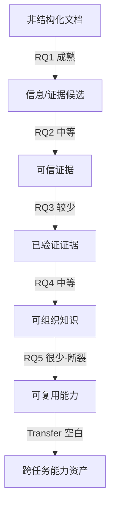

# 学年论文 · 六环节结构桥接重构方案

> 生成：2026-09-01
> 阶段性质：仅结构性方案（STOP，未改 thesis_draft.md）
> 目的：让文献综述结构与后续毕业论文研究问题形成自然理论递进，**不提前介绍 DICE**

---

## 0. 冻结前提（本方案的上位约束）

- 主线：`Document → Evidence → Validation → Knowledge → Capability → Transfer`
- 学年论文回答的核心问题：**现有研究分别解决了这条链上的哪些问题？哪些环节已成熟？哪些之间断裂？**
- 禁止：不介绍 DICE 实现、不写代码/架构/Phase/Runtime、不为配平文献数量而硬塞弱相关文献。
- 允许且鼓励的"不均衡"：RQ1 文献多、RQ5/Transfer 文献稀缺——这本身就是综述发现。

---

## 1. 新论文目录（七章）

```
一、引言
  1.1 研究背景
  1.2 问题提出：从"文档可处理"到"知识可复用"
  1.3 文献综述范围与研究思路
  1.4 本文结构

二、从文档到信息：文档理解与信息抽取研究进展        [RQ1]
  2.1 文档智能的发展
  2.2 文档信息抽取
  2.3 文档级关系抽取与复杂结构理解
  2.4 大语言模型对信息抽取范式的影响
  2.5 小结：抽取能力已较成熟，可信性属下一层问题

三、从信息到可信证据：信息可信性与事实性研究进展    [RQ2] ★新增核心章
  3.1 大模型生成信息的事实性问题
  3.2 幻觉的类型、成因与表现
  3.3 幻觉检测、归因与缓解
  3.4 信息核验与事实核查
  3.5 现有研究的边界：生成内容可信 ≠ 企业文档证据可信
  3.6 小结

四、从证据到知识：人在回路与知识组织研究进展        [RQ3 + RQ4]
  4.1 人在回路与人机协同
  4.2 验证信息的知识组织与复用
  4.3 小结：Validation ≠ Knowledge Organization

五、从知识到能力：知识复用与智能决策研究进展        [RQ5 + RQ6 部分] ★新增重要章
  5.1 知识驱动智能决策
  5.2 知识库与智能系统中的知识复用
  5.3 智能体/智能系统中的能力形成（压缩为背景）
  5.4 跨任务复用问题
  5.5 现有研究边界

六、现有研究评述与研究缺口                           [评述 ≥30%]
  6.1 各环节研究成熟度比较
  6.2 Document → Evidence 的边界
  6.3 Evidence → Validation 的边界
  6.4 Validation → Knowledge 的边界
  6.5 Knowledge → Capability 的边界
  6.6 Capability → Transfer 的研究空白
  6.7 综合研究缺口

七、结论与展望
```

---

## 2. 原章节 → 新章节迁移表

| 原章节/段落 | 新位置 | 处理方式 | 原因 |
|---|---|---|---|
| 摘要（"三层面梳理"） | 摘要+引言1.3 | **改写**为"六环节递进"表述 | 原摘要仍写"三个层面（文档理解/RAG/智能体）"，与六环节不符 |
| 英文摘要 Abstract | 对应改写 | 改写 | 同上，保持中英一致 |
| 关键词 | 保留+微调 | 保留 | 可加入"人在回路""知识复用" |
| 一、引言（背景段） | 1.1 | 保留 | 背景依然成立 |
| 引言（问题提出段，第17段） | 1.2 | 保留并**强化** | 原"体外诊断/医疗器械"场景保留，直接引出"可复用/可治理"问题 |
| 引言（综述范围段，第19段"三个递进层面"） | 1.3 | **改写**为六环节 | 原"三层面"→"六环节" |
| 二、文档理解与信息抽取（全文） | 第二章 | 保留+重组为2.1–2.5 | RQ1，内容主体可留用 |
| 三、检索增强生成与知识图谱（一）RAG演进 | 4.2（知识组织/服务） | **部分迁移+降位** | RAG 属"知识服务/组织"手段，不再是独立主线章节 |
| 三（二）知识图谱在知识组织中的作用 | 4.2 | 迁移 | Knowledge Organization |
| 三（二）中"时序知识图谱"段落 | 4.2 | 保留为背景 | 知识组织能力延伸 |
| 三（结尾"从向量到图谱只是组织方式"段） | 6.4 | 迁移并强化 | 这正是 Validation→Knowledge 边界论点 |
| 四、智能体记忆与能力构建机制（整章） | 5.3 + 5.4 | **大幅压缩+重新定位** | 从"主线章节"降为"Knowledge→Capability 旁支背景" |
| 四（一）智能体记忆研究进展 | 5.3 | 压缩 | 只作能力侧背景 |
| 四（一）SkillX/Graphiti | 暂不列为核心论据 | **删除或降为背景脚注** | CNKI 池无法承担主要论证职责，避免"提及不可引用来源" |
| 四（二）从经验到能力的构建逻辑 | 5.3/5.4 | 压缩保留观点 | "能力界定/复用/迁移"观点仍有价值 |
| 四（结尾"垂直领域链条关注有限"段） | 6.7 或 1.2 | 迁移强化 | 本身就是缺口引子 |
| 五、评述与研究缺口（一）总体评述 | 6.1 | 保留+扩展为六环节比较 | 升级横向比较 |
| 五（二）三个"≠" | 6.2–6.5 | **保留并扩展**为四边界+空白 | 核心评述，从 3 个≠升级为 4 边界+1 空白 |
| 五（三）研究缺口及意义 | 6.7 | 保留+补"Transfer 空白" | 结论归于综合缺口 |
| 六、结论 | 七章 | 微调 | 只做"结构断裂"结论，不展开 DICE |
| 参考文献（25 条占位） | 参考文献 | **整体重写**为最终 22 篇真实文献 | 现为"待填"占位 |

---

## 3. 每章研究问题

| 章 | 研究问题 |
|---|---|
| 二 | 现有研究能否高效地把非结构化文档转化为结构化信息/证据候选？（答：能，且成熟） |
| 三 | 机器生成/抽取出来的信息，为什么不能天然视为可信证据？（答：幻觉与事实性问题） |
| 四 | 如何让"证据"经人工验证后变成"可组织的知识"？（答：人在回路 + 知识组织，但二者未被打通） |
| 五 | 知识能否、以及如何转化为可复用能力？（答：有旁证，但缺完整转换机制） |
| 六 | 六环节中，哪些成熟、哪些断裂、缺口在哪？（答：Document→Evidence 成熟；Transfer 空白） |

---

## 4. 每章拟使用的核心文献

| 章 | 核心文献 |
|---|---|
| 二 | 崔磊①、祝涛杰②、刘成林③、王永胜④、王展⑤ |
| 三 | 刘泽垣⑥、樊骐瑞⑦、何富威⑧（待卷期页锁） |
| 四（4.1） | 付雅明⑨、陈勇⑩、周辉⑪、吴诺曼⑫ |
| 四（4.2） | 赵浜⑬、高颖⑭、陈宋生⑮、王亮⑯ |
| 五 | 赵浜⑬（复用，知识→能力向）、蒲志强⑰ |
| 六 | 全部 22 篇 + 综合比较 |
| 七 | 无需新增，用六章结论收敛 |

> 编号对应上一阶段最终池；赵浜⑬跨 RQ4/RQ5，正文需区分"知识组织" vs "能力转化"两个不同功能，避免一处笼统引用。

---

## 5. 每章需要补写的内容

| 章 | 需补写 |
|---|---|
| 1.3 | "六环节"范围说明（原文只有"三层面"） |
| 3（整章） | **全新章节**——目前草稿完全缺失，需新写约 800–1000 字 |
| 4.1 | 人在回路小节——目前草稿完全缺失，需新写约 600–800 字 |
| 4.3 | "Validation ≠ Knowledge Organization"小结 |
| 5.1/5.2 | 知识驱动决策/复用小节——需新写，文献少所以篇幅也应克制（约 500–700 字） |
| 6.1 | 六环节成熟度比较表 + 横向比较（草稿缺横向比较） |
| 6.6 | "Capability → Transfer 研究空白"小节——全新，但篇幅简短即可 |

---

## 6. 建议删除/压缩的旧内容

| 旧内容 | 处理 | 原因 |
|---|---|---|
| SkillX、Graphiti 命名提法 | 删除或降为脚注背景 | CNKI 池无对应文献，避免"不可引用来源" |
| 技术史叙述（HMM/CRF/SVM、BERT/RoBERTa、版面分析/GNN） | 弱化为常识性背景，或补真实出处 | 这些是 LSTM/BERT 时代文献，不在 CNKI 池中 |
| "智能体记忆"整章 | 大幅压缩，从主线降为背景 | 不再作为独立主线 |
| 第三章"RAG 演进"大段 | 压缩，并入 4.2 | RAG 不再是独立主线章节 |

---

## 7. 六环节逻辑关系图（纯文本 + Mermaid）

```
纯文本版：

非结构化文档
   │  [RQ1 文档理解/信息抽取]  —— 成熟
   ▼
信息 / 证据候选
   │  [RQ2 可信性/事实核查]  —— 中等
   ▼
可信证据
   │  [RQ3 人在回路验证]  —— 较少
   ▼
已验证证据
   │  [RQ4 知识组织]  —— 中等
   ▼
可组织知识
   │  [RQ5 知识→能力]  —— 很少（断裂点）
   ▼
可复用能力
   │  [RQ6/Transfer 跨任务复用]  —— 空白
   ▼
跨任务能力资产
```



---

## 8. 如何自然过渡到毕业论文（结论章，克制版）

结论只做两件事：
1. 综述发现：研究链条存在**结构性断裂**（Document→Evidence 成熟，Knowledge→Capability 弱，Capability→Transfer 空白）。
2. 一句克制的方向句（不展开 DICE）：

> "后续研究可进一步探索如何将经过人工验证的证据转化为结构化、可治理且可跨任务复用的能力资产。"

这句话即为毕业论文的问题入口，无需在本学年论文中展开。

---

## 9. 落地方案二选一（待你确认后再动手）

- **方案 A（推荐）**：按上述七章骨架，仅"搭骨架 + 归位旧内容 + 标记补写位"，不写补写位的正文，先给你看结构。
- **方案 B**：骨架 + 旧内容归位 + 顺带补齐第三/四/五章的补写位初稿（会新增正文文字）。

本阶段**未修改 thesis_draft.md**，仅生成本方案文件。
